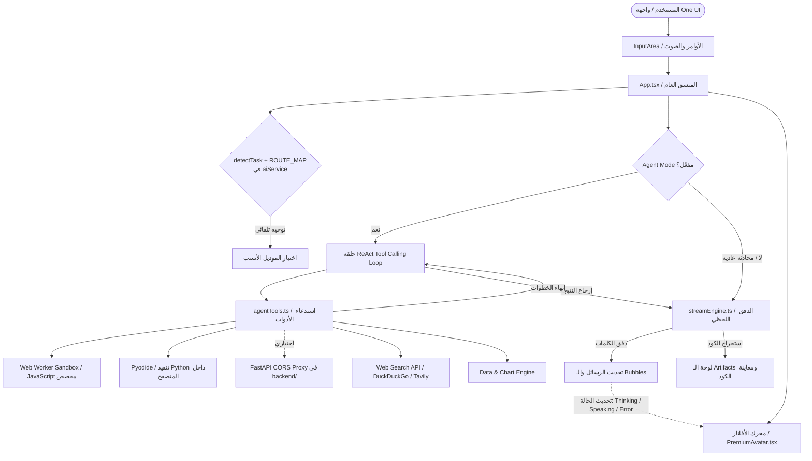

# ⚡ GBackgroundAI — Beast v15
> **نظام الذكاء الاصطناعي متعدد النماذج المتقدم والوكيل المستقل (Autonomous Multi-Model AI Agent & One UI Workspace)**

[](https://www.typescriptlang.org/)
[](https://react.dev/)
[](#-التشغيل-والاختبارات-setup--tests)
[](https://tailwindcss.com/)
[](https://fastapi.tiangolo.com/)
[](https://capacitorjs.com/)
[](#-samsung-one-ui-67-mobile-design-system)
[](#-security--sandboxing-architecture)

---

## 📑 فهرس المحتويات (Table of Contents)

1. [نظرة عامة على المشروع (Project Overview)](#-نظرة-عامة-على-المشروع-project-overview)
2. [الميزات والقدرات الرئيسية (Key Features)](#-الميزات-والقدرات-الرئيسية-key-features)
3. [الهيكل البرمجي ونظام الملفات (Project Structure)](#-الهيكل-البرمجي-ونظام-الملفات-project-structure)
4. [مخطط تدفق البيانات والمعمارية (Architecture & Data Flow)](#-مخطط-تدفق-البيانات-والمعمارية-architecture--data-flow)
5. [محرك التعابير والأفاتار التفاعلي (Dynamic Avatar Engine)](#-محرك-التعابير-والأفاتار-التفاعلي-dynamic-avatar-engine)
6. [محرك التوجيه الذكي ومزودي الذكاء الاصطناعي (AI Routing & Providers)](#-محرك-التوجيه-الذكي-ومزودي-الذكاء-الاصطناعي-ai-routing--providers)
7. [سجل أدوات الوكيل الذكي (Agent Tools Registry)](#-سجل-أدوات-الوكيل-الذكي-agent-tools-registry)
8. [معمارية الحماية والعزل الأمني (Security & Sandboxing)](#-معمارية-الحماية-والعزل-الأمني-security--sandboxing-architecture)
9. [دليل المطور للتوسيع والتطوير (Developer Extension Guide)](#-دليل-المطور-للتوسيع-والتطوير-developer-extension-guide)
10. [التثبيت والتشغيل المحلي (Setup & Installation)](#-التثبيت-والتشغيل-المحلي-setup--installation)
11. [ملاحظات وتوصيات للمبرمجين (Developer Notes & Best Practices)](#-ملاحظات-وتوصيات-للمبرمجين-developer-notes--best-practices)
12. [ما الجديد في Beast v15 (Changelog + Known limits)](#-ما-الجديد-في-beast-v15-changelog)
13. [التشغيل والاختبارات (Setup & Tests)](#-التشغيل-والاختبارات-setup--tests)

---

## 🌟 نظرة عامة على المشروع (Project Overview)

تطبيق **GBackgroundAI (Beast v15)** هو منصة عمل متكاملة للذكاء الاصطناعي تجمع بين:
* **نظام الوكيل المستقل الذكي (Autonomous Agent Mode):** القادر على التفكير، تخطيط الخطوات، وتشغيل أكثر من 20 أداة برمجية وتنفيذية ذاتياً.
* **محرك ألعاب وتحريك رمزي للأفاتار (Procedural 60fps Avatar Engine):** يعبر بصرياً عن حالات التفكير، التوليد، التحليل، الأخطاء، والنجاح مع تتبع حركة المؤشر والعينين والتنفس الإجرائي.
* **واجهة مستخدم محسنة لمعايير Samsung One UI:** تضمن سهولة الاستخدام بيد واحدة (One-handed ergonomics) مع أوراق سحب سفلية (Bottom Sheets) وقوائم انسيابية.
* **بيئات تنفيذ معزولة (Multi-Tier Execution Sandboxes):** تشغيل Python فعلياً داخل المتصفح عبر **Pyodide** (يُحمَّل من CDN عند أول استخدام فقط)، وتشغيل JavaScript داخل **Web Worker** معزول عن الـ DOM. أمّا خادم **FastAPI** في `backend/` فهو **اختياري** ويعمل كـ CORS proxy للطلبات التي يرفضها المتصفح — لا ينفّذ بايثون.
* **بيئة معاينة برمجية حية (Live Code Sandbox & Artifacts Manager):** لعرض وتجربة كود HTML/CSS/JS وتصدير المشاريع بضغطة زر.

---

## 🆕 ما الجديد في Beast v15 (Changelog)

هذه النسخة ركّزت على **إصلاح ما كان ظاهراً في الواجهة لكنه غير موصول بالمنطق**، بدل إضافة مزايا جديدة للعرض:

| # | الإصلاح | الملف | الأثر |
| :-- | :--- | :--- | :--- |
| 1 | كان يُرسل حجم نافذة السياق (`mk`) كحدّ للـ `max_tokens` (مثلاً 2,097,152 لـ Gemini Pro) فترفض معظم المزودين الطلب برسالة 400. أُضيفت حدود إخراج حقيقية لكل نموذج + دالة `resolveMaxOutputTokens` | `aiService.ts`, `App.tsx` | الطلبات تعمل فعلياً على Groq/NVIDIA/Gemini |
| 2 | إعداد «عدد رسائل السياق» `ctx` كان يُعرض ولا يُقرأ أبداً | `aiService.ts` (`buildCtx`) | التحكم بالسياق صار حقيقياً |
| 3 | «تلخيص تلقائي» (autoSum/sumThreshold/sumKeep) كان مفتاحاً بدون وظيفة | `summarizeHistory.ts` | يلخّص القديم ويحقنه كسياق بدل فقدان أول المحادثة |
| 4 | مفتاح Web Search في شريط الإدخال كان زينة | `App.tsx` | يبحث فعلياً ويحقن النتائج (مع/بدون Agent) |
| 5 | أدوات Agent الوهمية (~25 أداة تعيد JSON ملفّق) كانت معلنة كلها للنموذج | `toolPolicy.ts`, `agentTools.ts` | من 60 أداة إلى ~25 افتراضياً، والمحاكاة تُوسم `[SIMULATED DEMO TOOL]` |
| 6 | الكود المصدري للتطبيق كان يُضمَّن كاملاً في الحزمة عبر `import.meta.glob('?raw')` | `projectMemory.ts` | الحزمة الأولى من 2.9 MB إلى 320 KB، ولم يعد المصدر مكشوفاً للمستخدم |
| 7 | React.lazy للصفحات الثقيلة + `chart.js` عند الطلب + `highlight.js/lib/common` | `vite.config.ts`, `App.tsx` | تحميل أولي أخف بكثير على الهاتف |
| 8 | أخطاء المزودين كانت `[HTTP 401] {"json…"} ` خامّة، والردود غير المتدفقة تُنتج فقاعة فارغة | `streamEngine.ts` | رسائل مفهومة + دعم بوابات Ollama/proxy غير المتدفقة |
| 9 | بحث داخل المحادثة من الـ Header (زر البحث كان لا يفعل شيئاً) + شريط فارغ للمحادثة الجديدة | `Header.tsx`, `ChatPage.tsx` | تصفية الرسائل + اقتراحات البداية |
| 10 | GSoulEngine يكتب فقط عند استخدام `remember`، و`clearWorking()` كان يمسح `sessionStorage` بالكامل | `GSoulEngine.ts`, `App.tsx` | ذاكرة حقيقية + استرجاع في كل طلب، بدون إتلاف بيانات أخرى |
| 11 | مخطط `make_chart` كان يُعرض للنموذج فقط ولا يظهر للمستخدم | `App.tsx`, `AgentBubble.tsx` | الرسم يظهر في الفقاعة ويمكن تنزيله PNG |
| 12 | تعطل التطبيق عند حذف آخر محادثة / إرسال من شاشة الترحيب (محادثتان فارغتان) | `App.tsx` | حواجز أمان ومعالجة صحيحة |
| 13 | `select-none` عام كان يمنع تحديد/نسخ أي نص في المحادثة | `index.html`, `index.css` | النسخ والضغط المطوّل على Android يعملان |
| 14 | امتلاء التخزين كان يفشل بصمت في الـ console | `safeStorage.ts`, `App.tsx` | تقليم تلقائي للأقدم + تنبيه واضح للمستخدم |
| 15 | محوّل Gemini كان يتجاهل `baseUrl` المخصص | `GoogleGeminiAdapter.ts` | البروكسيات/النسخ الأخرى من الـ endpoint تعمل |
| 16 | طلبات الأدوات بدون مهلة تُعلّق حلقة الـ Agent للأبد، و«إيقاف» لم يكن يلغي الأدوات | `agentTools.ts`, `AgentOrchestrator.ts` | مهلة 20 ثانية + توقف فوري عند Stop |
| 17 | مواعيد غير مستخدمة: `express`, `dotenv`, `@google/genai`, `motion`, `lz-string` + 6 ملفات ميتة (~950 سطر) | `package.json`, `src/` | اعتماديات أقل وواجهة أنظف |
| 18 | اختبارات منطق + اختبار تصبير حقيقي للشجرة (`npm run smoke`) تغطي كل ما سبق | `tests/logic.test.ts`, `tests/smoke-render.tsx` | `npm test` / `npm run smoke` |

### حدود معروفة (اقرأها قبل الاستخدام)
* **الأدوات الموسومة `SIMULATED`** (`modbus_titan`, `device_hardware_overlord`, `termux_root_executor`, `voice_cloner`, `agent_swarm`, `ben10_consciousness_core`…) تُعيد بيانات تجريبية جاهزة **ولا تتصل بأي جهاز أو PLC**. هي معطّلة افتراضياً، وتُوسم نتائجها تلقائياً حتى لا يقدّمها النموذج كحقيقة.
* **`math_eval` يستخدم مُقيِّماً regex + `Function()`**: المُدخلات مقيّدة بحروف الأرقام والعمليات، لكنه يظل تقييماً لديناميكياً — لا تُفعّل أدوات مخصصة بثقة عمياء.
* **JS/Python Sandbox**: الـ Worker معزول عن الـ DOM لكنه **نفس الأصل** (same-origin) لذلك يمكنه تنفيذ `fetch`؛ وعزل معاينة HTML يعتمد على `iframe sandbox`. للحماية القصوى أضف CSP على مستوى الاستضافة.
* **المفاتيح تُخزَّن في `localStorage`** على الجهاز — مناسب للاستخدام الشخصي/التجريبي، وغير مناسب لمفاتيح إنتاجية أو أجهزة مشتركة. استخدم `VITE_*` للتطوير فقط (تُدمج في الحزمة).
* **`allowMixedContent` + `cleartext` في Capacitor** ضروريان للتواصل مع Termux/PLC عبر `http://` داخل الشبكة المحلية، ويجب ألا يُفعّلا في بناء يعتمد على شبكة عامة.
* **البحث في الويب** يعتمد على مفاتيح خارجية (Serper) أو على `r.jina.ai` كوسيط عام — لا تعتمد عليه لمحتوى حساس.

---

## 🧪 التشغيل والاختبارات (Setup & Tests)

```bash
npm install
npm run dev          # Vite على المنفذ 3000 (0.0.0.0 للمعاينة على الهاتف)
npm run lint         # tsc --noEmit
npm run lint:strict  # + noUnusedLocals/noUnusedParameters (بدون أخطاء حالياً)
npm test             # اختبارات المنطق + شكل الطلب الخارج (69 تأكيداً) بدون متصفح
npm run build        # حزمة الإنتاج

# اختياري: وسيط CORS
cd backend && pip install -r requirements.txt && uvicorn main:app --host 0.0.0.0 --port 8000
```

---

## 🚀 الميزات والقدرات الرئيسية (Key Features)

### 1. 🤖 نمط الوكيل الذكي المستقل (Autonomous Agent Mode)
- حلقة تفكير وتنفيذ متعددة الخطوات (`ReAct` / Iterative Tool Calling Loop).
- إمكانية تشغيل أدوات متتالية حتى حل المشكلة المعقدة.
- تسجيل خطوات الوكيل بالتفصيل (`AgentSteps`) وعرض حالة كل خطوة في الوقت الحقيقي.

### 2. ⚡ محرك التوجيه التلقائي للمهام (Auto Task Router)
- تحليل طبيعة السؤال أو الطلب آلياً (كود، تحليل بيانات، كتابة إبداعية، تلخيص، محادثة سريعة).
- توجيه الطلب تلقائياً إلى النموذج الأنسب والأنسب تكلفة أو سرعة.

### 3. 🎨 نظام الأفاتار التفاعلي والتعابير الحية (`/src/bot`)
- **22 تعبيراً مشاعرياً** (Joy, Think, Zen, Blink, Inquiet, Surprise, Focused, etc.).
- **6 حالات تحريك حركية** (Breathing, Floating, Scanning, Shake, Heartbeat, Bloom).
- محرك 60 إطار في الثانية يعمل بـ `requestAnimationFrame` مع تتبع نظرات العين وحركة الرأس وموجات الصوت عند التحدث.

### 4. 📱 تجربة هواتف Samsung One UI
- أزرار تفاعلية ضخمة سهلة الوصول للإبهام.
- بطاقات مستديرة بزوايا مدروسة ونظام ألوان داكن/فاتح مريح للعين (AMOLED Black / Warm Gray).
- تفاعل لمسي (Haptic Feedback) مدمج للحركات والأزرار.

### 5. 💻 بيئة معاينة وتصدير الكود (Live Code Preview & Artifacts)
- عزل الكود في `iframe` آمن مع وضع ملء الشاشة والتحديث الفوري.
- استخراج تلقائي للكود والمستندات المولدة وتنظيمها في مدير ملفات الـ Artifacts.

---

## 📁 الهيكل البرمجي ونظام الملفات (Project Structure)

```text
GBackgroundAI/
├── backend/                        # ⚙️ وسيط CORS اختياري (اختياري تماماً للتشغيل العادي)
│   ├── main.py                     # خادم FastAPI لتجاوز CORS: بحث الويب، ويكيبيديا، فحص المفاتيح
│   └── requirements.txt            # اعتمادات بايثون (fastapi, uvicorn, httpx, pydantic)
│
├── src/
│   ├── main.tsx                    # نقطة الدخول الرئيسية لـ React 18
│   ├── App.tsx                     # المنسق العام للمكونات والحالة العامة (Root Component)
│   ├── index.css                   # التنسيقات العامة وقواعد Tailwind CSS v4
│   │
│   ├── bot/                        # 🧠 محرك الأفاتار والتعابير الحية
│   │   ├── types.ts                # واجهات الأفاتار، السلوكيات، التعابير والحركات
│   │   ├── shape.ts                # معادلات مسارات الـ SVG ورسم الملامح هندسياً
│   │   ├── expressions.ts          # مصفوفة الـ 22 تعبيراً وحساب إحداثيات العيون والفم
│   │   ├── states.ts               # حالات التحريك (Scan, Breathe, Shake, Float...)
│   │   ├── keyframes.ts            # استيفاء الإطارات والتحويلات الحسابية
│   │   ├── behavior.ts             # ربط حالات الـ Agent مع أشكال الأفاتار
│   │   └── index.ts                # نقطة تصدير وحدات محرك الـ Bot
│   │
│   ├── components/                 # 🧩 واجهات ومكونات التطبيق
│   │   ├── ErrorBoundary.tsx       # صمام الأمان لمنع انهيار واجهة التطبيق
│   │   ├── Header.tsx              # شريط العنوان العلوي، مؤشر الحالة وزر المشروع
│   │   ├── InputArea.tsx           # شريط الإدخال، تسجيل الصوت، المرفقات، وعداد التوكن
│   │   ├── LivePreview.tsx         # نافذة المعاينة الحية للأكواد (Sandbox IFrame)
│   │   ├── PremiumAvatar.tsx       # المكون الرسومي للأفاتار المتحرك (Canvas/SVG)
│   │   │
│   │   ├── Chat/                   # مكونات شاشة المحادثة
│   │   │   ├── ChatPage.tsx        # صفحة الدردشة، شريط التمرير والتحكم
│   │   │   ├── AgentBubble.tsx     # فقاعة رد المساعد الذكي مع استعراض الكود والماركداون
│   │   │   ├── UserBubble.tsx      # فقاعة رسائل المستخدم مع المرفقات والتعديل
│   │   │   ├── ToolBubble.tsx      # فقاعة استدعاء أدوات الوكيل ونتائجها
│   │   │   └── ArtifactsPanel.tsx  # لوحة إدارة وتصفح الملفات والـ Artifacts المولدة
│   │   │
│   │   ├── Modals/                 # النوافذ المنبثقة وأوراق One UI السفلية
│   │   │   ├── ModelPickerModal.tsx    # نافذة اختيار وتبديل النماذج الذكية
│   │   │   ├── ProviderPickerModal.tsx # نافذة إدارة واختيار مزودي الذكاء الاصطناعي
│   │   │   ├── ProjectModal.tsx        # نافذة إدارة ملفات وسياق المشروع الحالي
│   │   │   ├── SessionsModal.tsx       # نافذة استعراض وإدارة سجل المحادثات
│   │   │   └── SnippetsModal.tsx       # نافذة القوالب والمطالبات السريعة
│   │   │
│   │   └── Pages/                  # الصفحات الرئيسية للشاشات
│   │       ├── WelcomeView.tsx     # الشاشة الترحيبية واستوديو تجربة الأفاتار
│   │       ├── SettingsPage.tsx    # صفحة الإعدادات الشاملة وتخصيص الواجهة والمزودين
│   │       └── ToolsSettings.tsx   # صفحة تفعيل وإدارة وبناء الأدوات المخصصة
│   │
│   ├── services/                   # ⚙️ خدمات الذكاء الاصطناعي والشبكة
│   │   ├── toolPolicy.ts           # 🛡️ سياسة ثقة الأدوات (حقيقية/محاكاة) وحظر الأدوات الوهمية افتراضياً
│   │   ├── summarizeHistory.ts     # تلخيص المحادثة التدريجي (Auto-summarize الحقيقي)
│   │   ├── safeStorage.ts          # كتابة آمنة على localStorage مع إعادة محاولة عند امتلاء الحصة
│   │   ├── agentTools.ts           # محرك تنفيذ أدوات الوكيل (Web, Code, Data, PLC…)
│   │   ├── aiService.ts            # خدمة الاتصال المباشر وتنسيق الطلبات مع الموديلات (ودوال resolveMaxOutputTokens/buildCtx)
│   │   ├── speechUtils.ts          # أدوات التعرف على الصوت والنطق الآلي (STT / TTS)
│   │   ├── streamEngine.ts         # محرك استقبال ودفق التوكن في الوقت الحقيقي
│   │   ├── providers/              # محولات بروتوكولات المزودين المتعددة
│   │   │   ├── OpenAICompatibleAdapter.ts # محول بروتوكول OpenAI / Groq / Ollama / NIM
│   │   │   ├── types.ts            # واجهات مزودي الذكاء الاصطناعي
│   │   │   └── index.ts
│   │   └── orchestrator/           # أوركسترا الوكلاء وحلقات ReAct
│   │       └── AgentOrchestrator.ts # إدارة دورة حياة الوكيل وتنفيذ الأدوات التكراري
│   │
│   └── types/                      # 📐 واجهات TypeScript ونماذج البيانات
│       └── index.ts                # تعريف Session, Message, Provider, Tool, File
│
├── capacitor.config.json           # إعدادات حزمة تطبيق الهواتف (Android / iOS)
├── metadata.json                   # بيانات ووصف التطبيق لمنصة AI Studio
├── package.json                    # حزم وتراخيص وتطبيقات Node.js
└── vite.config.ts                  # إعدادات مجمع Vite وخادم التطوير
```

---

## 🏗️ مخطط تدفق البيانات والمعمارية (Architecture & Data Flow)



---

## 🎭 محرك التعابير والأفاتار التفاعلي (Dynamic Avatar Engine)

يوجد المحرك بالكامل داخل مجلد `/src/bot` ويقدم تجربة بصرية فائقة السلاسة (60fps) دون استهلاك غير مبرر للمعالج:

### 1. حالات سلوك الوكيل (`AgentBehaviorState`)
| الحالة | الوصف | التعبير المقترن | الحركة المرافقة | لون التوهج |
| :--- | :--- | :--- | :--- | :--- |
| `idle` | الاستعداد والهدوء | `zen` | `breathe` (تنفس هادئ) | زمردي / أزرق خافت |
| `thinking` | معالجة الطلب والتفكير | `clin` | `float` (تحليق ناعم) | أزرق سماوي نيون |
| `speaking` | كتابة الرد وتوليد النصوص | `heureux` | `heartbeat` (نبض سريع) | زمردي حيوي |
| `analyzing` | تشغيل الأدوات وفحص الكود | `neutre` | `scan` (مسح ضوئي بالليزر) | بنفسجي كهربائي |
| `success` | اكتمال المهمة بنجاح | `clin` | `bloom` (وميض بهيج) | ذهبي / أخضر |
| `error` | فشل الاتصال أو خطأ برمجي | `inquiet` | `shake` (اهتزاز تحذيري) | أحمر ناري |
| `listening` | الاستماع للتسجيل الصوتي | `surpris` | `breathe` (ترقب) | تركواز متوهج |

### 2. التفاعل الفيزيائي المباشر
- **Gaze Tracking (تتبع النظرات):** تتبع حركة مؤشر الفأرة أو اللمس بزوايا ثلاثية الأبعاد خفيفة (`yaw`, `pitch`).
- **Autonomous Blinking (الرمش الذاتي):** رمشات جفون عشوائية كل 3-6 ثوانٍ تحاكي الكائنات الحية.
- **Sound Wave Reactivity (التفاعل الصوتي):** تذبذب فم الأفاتار بالتزامن مع موجات الصوت عند نطق الردود.

---

## 🌐 محرك التوجيه الذكي ومزودي الذكاء الاصطناعي (AI Routing & Providers)

يدعم النظام التكامل مع أي مزود متوافق مع واجهة OpenAI أو Gemini:

### المزودين المدعومين مسبقاً (Built-in Providers):
1. **Google Gemini:** النماذج فائقة السرعة والدقة (`gemini-2.5-flash`, `gemini-2.5-pro`).
2. **Groq Llama 3 / Mixtral:** استجابة فائقة السرعة تتجاوز 500 توكن/ثانية.
3. **NVIDIA NIM:** نماذج DeepSeek, Llama 3 70B مع تسريع بطاقات RTX.
4. **Ollama / Localhost:** تشغيل نماذج محلية 100% بدون إنترنت داخل جهازك.
5. **OpenRouter / Mistral / Anthropic:** دعم عبر محول `OpenAICompatibleAdapter`.

---

## 🛠️ سجل أدوات الوكيل الذكي (Agent Tools Registry)

يحتوي ملف `/src/services/agentTools.ts` على أكثر من 20 أداة برمجية جاهزة:

| اسم الأداة (`Tool Name`) | الوصف والوظيفة | بيئة التنفيذ |
| :--- | :--- | :--- |
| `web_search` | البحث اللحظي في الإنترنت واستخراج أحدث المعلومات والمصادر | DuckDuckGo / Serp API |
| `run_python` | تنفيذ أكواد بايثون الحسابية، الخوارزميات وتحليل البيانات | Pyodide (WebAssembly) داخل المتصفح |
| `exec_js` | تشغيل دوال وحسابات جافاسكريبت المتقدمة | Web Worker Sandbox |
| `data_analyst` | تحليل ملفات CSV/JSON وإنشاء رسوم بيانية تفاعلية | Pyodide (pandas) + Chart.js |
| `pdf_analyzer` | استخراج نصوص الملفات والبحث داخلها | Pyodide (pypdf) |
| `fetch_webpage` | جلب محتوى صفحات الويب وتحويلها إلى ماركداون نظيف | Web Scraper / Proxy |
| `git_repo_explorer` | فحص مستودعات GitHub واستعراض الملفات والأكواد | GitHub REST API |
| `trigger_n8n` | تشغيل مسارات الأتمتة (Workflows) عبر N8N Webhooks | Webhook Integration |
| `manage_project_files` | إنشاء، قراءة، تعديل وحذف ملفات داخل سياق المشروع | Virtual Project Workspace |
| `code_formatter` | تنسيق وتدقيق الأكواد وإصلاح الأخطاء الإملائية والبرمجية | Internal Formatter |
| `free_tts_stt` | تحويل النصوص إلى صوت طبيعي والتعرف على الكلام الصوتي | Web Speech API |

---

## 🔒 معمارية الحماية والعزل الأمني (Security & Sandboxing Architecture)

تم تصميم النظام ليعمل بأعلى معايير الأمان لمنع أي اختراق أو تسريب للبيانات:

### 1. حماية كود Python في السيرفر (`backend/main.py`)
- **Builtins Whitelisting:** تم إلغاء `__builtins__` الافتراضي واستبداله بقائمة بيضاء صارمة تضم فقط الدوال الرياضية والبيانية الآمنة (`abs`, `len`, `sum`, `range`, `dict`, إلخ).
- **Keyword Filtering:** فحص الكود قبل تنفيذه وحظر أي محاولات لاستدعاء:
  `['__import__', 'eval(', 'exec(', 'open(', 'os.', 'sys.', 'subprocess', 'shutil', 'socket']`.

### 2. حماية كود JavaScript المخصص في الواجهة (`executeSandboxedCustomTool`)
- لا يتم استخدام `new Function()` في سياق الصفحة الرئيسية نهائياً.
- يتم إنشاء **Web Worker معزول** في بيئة منفصلة لا تملك وصولاً إلى:
  `window`, `document`, `localStorage`, `document.cookie`, أو أي مفاتيح API حساسة.
- ضبط مهلة زمنية قصوى (Timeout) قدرها 5000ms لقتل أي حلقة تكرار لا نهائية.

### 3. تعقيم الماركداون والـ HTML
- تمرير كافة المخرجات عبر مكتبة `DOMPurify` لمنع ثغرات XSS.

---

## 👨‍💻 دليل المطور للتوسيع والتطوير (Developer Extension Guide)

### 1. كيفية إضافة أداة جديدة للوكيل (`Custom Tool`)
افتح ملف `/src/services/agentTools.ts`:
1. عرّف واجهة الأداة وبياناتها في مصفوفة `BUILTIN_AGENT_TOOLS`:
```typescript
{
  id: 'my_custom_tool',
  name: 'My Custom Tool',
  description: 'وصف ما تقوم به الأداة بدقة ليتمكن الذكاء الاصطناعي من استدعائها',
  category: 'data',
  parameters: {
    type: 'object',
    properties: {
      query: { type: 'string', description: 'المدخل المطلوب' }
    },
    required: ['query']
  }
}
```
2. أضف الدالة المنفذة في محرك التوزيع داخل `executeAgentTool`:
```typescript
case 'my_custom_tool':
  result = await executeMyCustomTool(args.query);
  break;
```

### 2. كيفية إضافة تعبير جديد للأفاتار (`Avatar Expression`)
افتح `/src/bot/expressions.ts`:
```typescript
export const MY_NEW_EXPRESSION: BotExpression = {
  id: 'excited',
  labelEn: 'Excited',
  labelAr: 'متحمس',
  eyeLeft: { openY: 1.2, slant: 5, pupilScale: 1.1 },
  eyeRight: { openY: 1.2, slant: -5, pupilScale: 1.1 },
  mouth: { curve: 0.8, openY: 0.6, width: 24 },
  eyebrows: { height: 1.2, slant: 10 }
};
```

---

## 💻 التثبيت والتشغيل المحلي (Setup & Installation)

### المتطلبات الأساسية (Prerequisites):
- Node.js 18+ أو Bun
- Python 3.10+ (لتشغيل ساندبوكس البايثون)
- مدير الحزم `npm` أو `bun`

### خطوات التشغيل:

1. **استنساخ المستودع وتثبيت اعتمادات الواجهة:**
```bash
# تثبيت حزم الواجهة الأمامية
npm install
```

2. **إعداد وتشغيل بيئة بايثون (Backend Sandbox):**
```bash
# الانتقال لمجلد السيرفر
cd backend
python -m venv venv
source venv/bin/activate  # في ويندوز: venv\Scripts\activate
pip install -r requirements.txt

# تشغيل خادم بايثون على المنفذ 8000
uvicorn main:app --host 0.0.0.0 --port 8000 --reload
```

3. **تشغيل خادم الواجهة الأمامية (Vite Dev Server):**
```bash
# من المجلد الرئيسي للمشروع
npm run dev
```
افتح المتصفح على: `http://localhost:3000`

4. **بناء المشروع للإنتاج (Production Build):**
```bash
npm run build
```

5. **تشغيل نسخة الهواتف (Capacitor Mobile):**
```bash
npx cap sync
npx cap open android # أو npx cap open ios
```

---

## 📌 ملاحظات وتوصيات للمبرمجين (Developer Notes & Best Practices)

- **إدارة التخزين (State Persistence):** تم استخدام Debouncing في حفظ الـ `localStorage` لتفادي تجمد الواجهة أثناء دفق النصوص الطويلة.
- **صيانة الذاكرة (Memory Management):** استخدم دائماً `React.memo` على فقاعات الدردشة (`AgentBubble`, `UserBubble`) لأن إعادة تصيير مئات الرسائل في كل ثانية يستهلك المعالج.
- **استدعاء الأيقونات:** جميع الأيقونات يجب استيرادها حصراً من مكتبة `lucide-react` لضمان التناسق والسرعة.
- **المفاتيح الحساسة:** لا تضع أبداً أي مفاتيح API داخل ملفات الكود المصدري؛ استخدم دائماً شاشة الإعدادات أو المتغيرات البيئية `.env`.

---

<div align="center">
  <sub>صُمم وطُوّر بأعلى معايير الإتقان والأداء ليكون مساعد الذكاء الاصطناعي الأقوى والأشمل 🚀</sub>
</div>
